# Chatrix - Claude-Compatible AWS Bedrock API

Chatrix is a Claude-compatible API server that provides access to AWS Bedrock foundation models through familiar Claude/Anthropic endpoints. Deploy it as a containerized Lambda function for cost-effective, scalable AI inference.

## Architecture

```mermaid
graph TB
    A[👤 User / Claude Code Client] -->|"① HTTPS Request"| B[🌐 your-domain.com]
    B -->|"② CDN Route"| C[☁️ CloudFront Distribution]
    C -->|"③ Forward"| D[⚡ Lambda Function URL]
    D -->|"④ Proxy"| E[🔌 AWS Lambda Web Adapter]
    E -->|"⑤ HTTP"| F[🚀 Fastify Server<br/>Port 3000]

    F -->|"⑥ Validate Token"| G[(🔐 AWS Secrets Manager)]
    G -.->|"API Key"| F

    F -->|"⑦ ConverseStream API"| H[🤖 AWS Bedrock Runtime]
    H -->|"⑧ Inference"| I[🧠 Claude Models<br/>Sonnet 4.5 / Haiku / etc.]
    I -->|"⑨ Stream Chunks"| H
    H -->|"⑩ Response Stream"| F

    F -->|"⑪ JSON + Cost Data"| E
    E -->|"⑫ Response"| D
    D -->|"⑬ HTTPS"| C
    C -->|"⑭ Stream"| B
    B -->|"⑮ JSON Response"| A

    F -.->|"📊 Logs"| J[(📝 CloudWatch Logs)]

    style A fill:#e3f2fd,stroke:#1976d2,stroke-width:3px,color:#000
    style B fill:#fff3e0,stroke:#f57c00,stroke-width:2px,color:#000
    style C fill:#fff3e0,stroke:#f57c00,stroke-width:2px,color:#000
    style D fill:#f3e5f5,stroke:#7b1fa2,stroke-width:2px,color:#000
    style E fill:#f3e5f5,stroke:#7b1fa2,stroke-width:2px,color:#000
    style F fill:#00d4aa,stroke:#00a082,stroke-width:3px,color:#000
    style G fill:#ffebee,stroke:#c62828,stroke-width:2px,color:#000
    style H fill:#ff9800,stroke:#e65100,stroke-width:3px,color:#000
    style I fill:#ff6f00,stroke:#e65100,stroke-width:3px,color:#fff
    style J fill:#e8f5e9,stroke:#2e7d32,stroke-width:2px,color:#000
```



**Request Flow**:
1. Client sends request to your custom domain (e.g., `chatrix.example.com`)
2. CloudFront routes to Lambda Function URL
3. Lambda Web Adapter proxies to Fastify server (port 3000)
4. Server validates Bearer token via Secrets Manager (cached)
5. Converts Anthropic API format → Bedrock ConverseStream API
6. Streams response back to client in real-time
7. Returns usage metrics with cost tracking (USD)

## Features

- 🔌 **Claude-Compatible**: Drop-in replacement for Claude API clients
- 🏗️ **AWS Bedrock Integration**: Supports Claude 3.5/3.7/4/4.5 and DeepSeek R1
- 💰 **Cost Tracking**: Real-time cost calculation in USD per request
- 🚀 **Streaming Support**: Real-time response streaming via ConverseStream API
- ⚡ **High Performance**: Fastify + Lambda Web Adapter + ARM64
- 🔐 **Secure**: API key authentication via AWS Secrets Manager

## Quick Start

### Prerequisites

- Node.js 18+
- AWS account with Bedrock access
- AWS credentials configured

### Setup AWS Credentials

```bash
export AWS_ACCESS_KEY_ID=your_access_key
export AWS_SECRET_ACCESS_KEY=your_secret_key
export AWS_REGION=us-west-2
```

### Install Dependencies

```bash
pnpm install
```

### Start Server

```bash
pnpm start
```

Server runs on `http://localhost:3000`

## API Endpoints

### POST /v1/messages

Anthropic-compatible chat completion endpoint with streaming support.

**Request**:
```bash
curl -X POST https://your-chatrix-domain.com/v1/messages \
  -H "Authorization: Bearer YOUR_API_KEY" \
  -H "Content-Type: application/json" \
  -d '{
    "model": "claude-sonnet-4-20250514",
    "max_tokens": 1024,
    "messages": [
      {"role": "user", "content": "Explain quantum computing"}
    ]
  }'
```

**Response**:
```json
{
  "id": "msg_1234567890",
  "type": "message",
  "role": "assistant",
  "content": [{"type": "text", "text": "..."}],
  "model": "claude-sonnet-4-20250514",
  "usage": {
    "input_tokens": 15,
    "output_tokens": 256,
    "total_tokens": 271,
    "cost": {
      "input_cost": 0.000045,
      "output_cost": 0.00384,
      "total_cost": 0.003885,
      "currency": "USD"
    }
  }
}
```

### POST /v1/messages/count_tokens

Estimate token count before making a request.

### GET /health

Health check endpoint (returns 200 OK when service is healthy).

## Supported Models

| Model | Model ID | Input (per 1K tokens) | Output (per 1K tokens) |
|-------|----------|----------------------|------------------------|
| Claude 3.5 Haiku | `claude-3-5-haiku-20241022` | $0.0008 | $0.004 |
| Claude 3.7 Sonnet | `claude-3-7-sonnet-20250219` | $0.003 | $0.015 |
| Claude Sonnet 4 | `claude-sonnet-4-20250514` | $0.003 | $0.015 |
| Claude Sonnet 4.5 | `claude-sonnet-4-5-20250929` | $0.003 | $0.015 |
| Claude Haiku 4.5 | `claude-haiku-4-5-20251001` | $0.0008 | $0.004 |
| Claude Opus 4.1 | `claude-opus-4-1-20250805` | Higher | Higher |
| DeepSeek R1 | `deepseek-r1-v1` | $0.0014 | $0.0028 |

**Note**: Claude 4.5+ models support EITHER `temperature` OR `topP`, not both.

## Use with Claude Code

Configure Claude Code to use Chatrix:

```bash
export ANTHROPIC_BASE_URL=https://your-chatrix-domain.com
export ANTHROPIC_AUTH_TOKEN="your-api-key"
```

For local testing:
```bash
export ANTHROPIC_BASE_URL=http://localhost:3000
export ANTHROPIC_AUTH_TOKEN="some-api-key"
```

## Deployment

### Infrastructure Requirements

- AWS Account with Bedrock model access enabled
- OpenTofu/Terraform installed
- Docker with buildx support
- GitHub repository (for automated deployments)

### Deploy with OpenTofu

```bash
# Initialize and validate
tofu init
tofu fmt
tofu validate

# Review changes
tofu plan

# Deploy infrastructure
tofu apply
```

This creates:
- ECR repository for container images
- Lambda function (ARM64, 512MB memory, 60s timeout)
- Lambda Function URL with CORS enabled
- IAM roles and policies for Bedrock + Secrets Manager access
- CloudWatch Logs (7-day retention)
- OIDC provider for GitHub Actions

### Automated Deployment

GitHub Actions automatically builds and deploys on:
- Release publication (uses release tag)
- Manual workflow dispatch (custom tag or commit SHA)

The workflow:
1. Authenticates via OIDC (no long-lived credentials)
2. Builds ARM64 Docker image
3. Pushes to ECR with version tag + `latest`
4. Updates Lambda function with new image

### Setting Up API Keys

Create a secret in AWS Secrets Manager:

```bash
aws secretsmanager create-secret \
  --name prod/your-app/api-key \
  --secret-string '{"api_key":"your-secure-api-key-here"}' \
  --region us-west-2
```

Set the secret name in Spacelift or as environment variable:
```bash
TF_VAR_secret_name=prod/your-app/api-key
```

## Development

### Local Development

```bash
# Install dependencies (always use pnpm)
pnpm install

# Start local server
pnpm start

# Server runs on http://localhost:3000
```

### Docker Development

```bash
# Build image
docker build -t chatrix:dev .

# Run container
docker run -p 3000:3000 \
  -e AWS_ACCESS_KEY_ID=$AWS_ACCESS_KEY_ID \
  -e AWS_SECRET_ACCESS_KEY=$AWS_SECRET_ACCESS_KEY \
  -e AWS_REGION=us-west-2 \
  chatrix:dev

# Build for Lambda (ARM64)
docker buildx build --platform linux/arm64 -t chatrix:latest .
```

### Adding New Models

1. Add model ID mapping in `src/modules/foundation-models.js`
2. Add pricing in `src/index.js` BEDROCK_PRICING object
3. If Claude 4.5+, add to `claude45Models` array
4. Update IAM permissions in `main.tf`

## Technical Details

### Lambda Web Adapter

Chatrix uses [AWS Lambda Web Adapter](https://github.com/awslabs/aws-lambda-web-adapter) to run a standard Fastify HTTP server inside Lambda. This approach:

- ✅ Simplifies development (write regular HTTP server code)
- ✅ Easy local testing (same code runs locally and in Lambda)
- ✅ No Lambda-specific handlers needed
- ✅ Automatic health checks and graceful shutdown

### Bedrock Converse API

Uses the modern Bedrock Converse API (`ConverseStreamCommand`) instead of legacy `InvokeModelWithResponseStream`:

- Unified interface across all Bedrock models
- Native token counting (no approximation)
- Simplified payload structure
- Better streaming support

See `docs/Migration.md` for migration details.

## Project Structure

```
chatrix/
├── src/
│   ├── index.js                    # Fastify server + API endpoints
│   └── modules/
│       └── foundation-models.js    # Model ID mapping
├── .github/workflows/
│   └── build-push.yml             # CI/CD pipeline
├── main.tf                        # Lambda + ECR + IAM
├── cloudfront.tf                  # CDN distribution
├── github-actions.tf              # OIDC configuration
├── provider.tf                    # AWS provider setup
├── variables.tf                   # Terraform variables
├── Dockerfile                     # Container image definition
└── docs/                          # Additional documentation
```

## License

Apache-2.0

## Contributing

This is a personal project. Feel free to fork and adapt for your own use.
